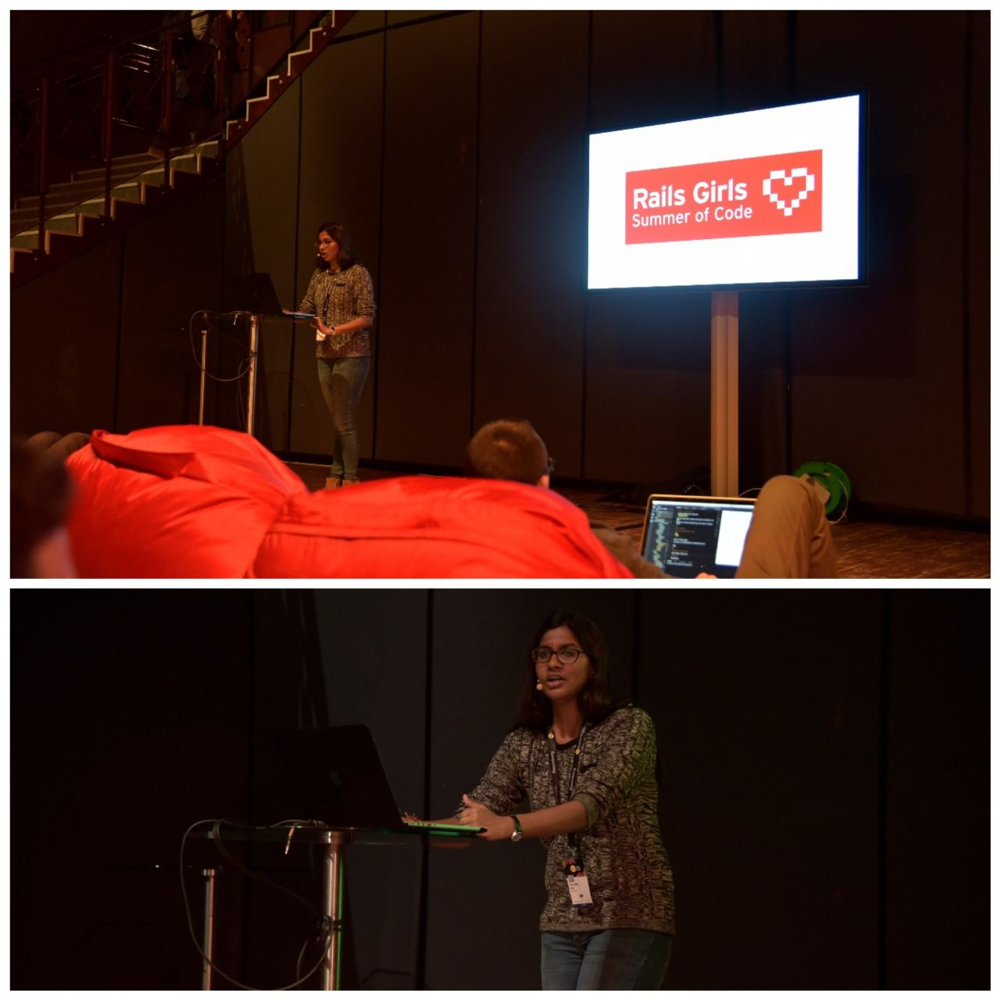

I started working on Ruby and Ruby on Rails in the first year of engineering and and by the end of second year, I was selected for the [Rails Girls Summer of Code](https://railsgirlssummerofcode.org/), a program which accepts 20 teams all over the world (2 students per team) each year and provides them with an open-source project to work on. It is a global fellowship program for women and non-binary coders.

 

As a part of this program, I had the opportunity to deliver a [talk](https://railsgirlssummerofcode.org/blog/2017-12-26-team-bundledore-at-dotjs-and-dotcss) at the dotJS conference 2017 in Paris. My talk was on my work during the summer and a short description of the RGSoC initiative.

Hackathons are one of my favourite places to be in. The energy, the buzz and the chance to work with an extremely unique and driven set of people to create a prototype are what gets me excited. All through my undergraduate, I attended numerous hackathons, some within India while some international. 

The first hackathon I attended was the APNIC Hackathon in Nepal. [APNIC](https://www.apnic.net/)(Asia Pacific Network Information Center) is the Regional Internet Registry administering IP addresses for the Asia Pacific. The aim of APNIC 45 was to promote the spread of IPv6. Although it has been more than 20 years since the 'new' version of the Internet Protocol was introduced by the IETF, it has not been fully deployed yet. Different metrics show that many networks are already using IPv6 but still there is work to do. 

<blockquote class="twitter-tweet">
Shout out to the 8 female participants of APNIC&#39;s first <a href="https://twitter.com/hashtag/Hackathon?src=hash&amp;ref_src=twsrc%5Etfw">#Hackathon</a>. They spent some time with Sylvia from <a href="https://twitter.com/ApnicFoundation?ref_src=twsrc%5Etfw">@ApnicFoundation</a> &amp; <a href="https://twitter.com/ripe_ncc?ref_src=twsrc%5Etfw">@RIPE_NCC</a> &#39;s Vesna. Brilliant minds all of you! <a href="https://twitter.com/hashtag/womenintech?src=hash&amp;ref_src=twsrc%5Etfw">#womenintech</a> <a href="https://twitter.com/hashtag/APRICOT2018?src=hash&amp;ref_src=twsrc%5Etfw">#APRICOT2018</a> <a href="https://t.co/8u6rThuAAQ">pic.twitter.com/8u6rThuAAQ</a>
&mdash; APNIC (@apnic) <a href="https://twitter.com/apnic/status/967607549842292737?ref_src=twsrc%5Etfw">February 25, 2018</a></blockquote>  

A total of [25 hackers](https://2018.apricot.net/program/hackathon/) were chosen from the Asia-Pacific region. It was an honour to be selected to attend this hackathon.

Around this time, I was awarded the WeTech Qualcomm Global Scholarship. This program is a partnership between the Institution of International Education and Qualcomm that invests in young women and future leaders in STEM (Science, Technology, Engineering and Math). 

Through the four years of my undergraduate, I was also involved in programs that help guide women into tech. One of those initiatives was by the [Rethink](https://wiki.rethinkfoundation.in/Rethink_Wiki:About) initiative.
A program I participated in as a coach was the [WIT Learning Program](https://wit.rethinkfoundation.in/).

After completing a bachelors in engineering, I worked at [Bang the Table](https://www.bangthetable.com/), a startup focussed on building a product that encourages community engagement. Bang the Table would later be [acquired](https://www.globenewswire.com/news-release/2021/06/17/2249019/0/en/Granicus-to-Acquire-SaaS-GovTech-Leaders-Bang-the-Table-and-OpenCities.html) by [Granicus](https://granicus.com/). My role primiarly involved a lot of Rails.
 
In fall of 2021, I will be be a part of the [Erasmus-Mundus LCT](https://lct-master.org/contents_2014/overview.php) program as a EMJMD scholar, completing the first year at Charles University, Prague and the second year at Saarland University, Germany. Wish me luck !
