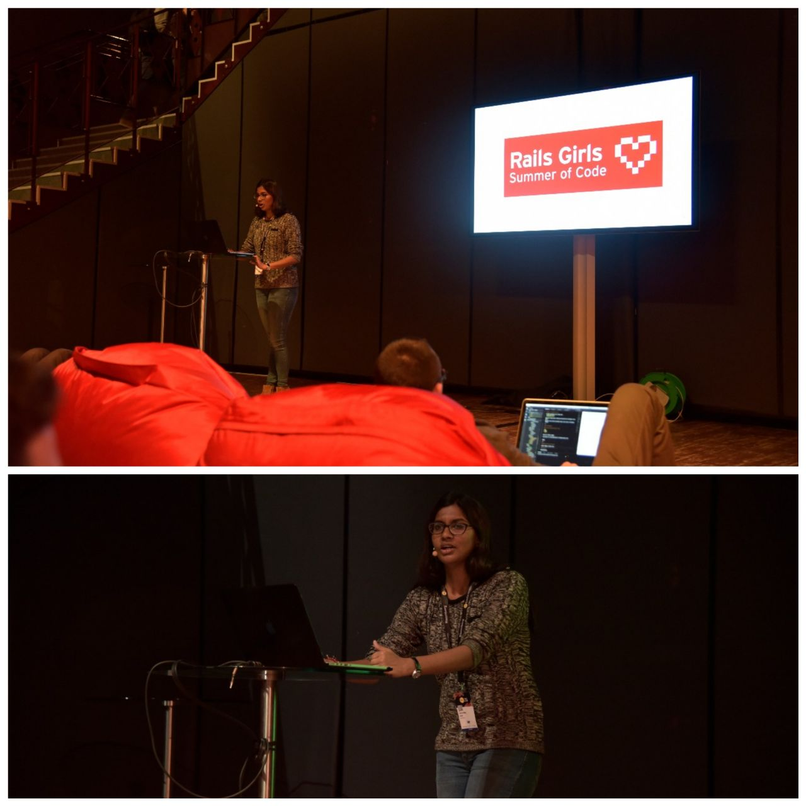

I started working on Ruby and Ruby on Rails in the first year of engineering and and by the end of second year, I was selected for the [Rails Girls Summer of Code](https://railsgirlssummerofcode.org/), a program which accepts 20 teams all over the world (2 students per team) each year and provides them with an open-source project to work on. It is a global fellowship program for women and non-binary coders.

 

As a part of this program, I had the opportunity to deliver a [talk](https://railsgirlssummerofcode.org/blog/2017-12-26-team-bundledore-at-dotjs-and-dotcss) at the dotJS conference 2017 in Paris. My talk was on my work during the summer and a short description of the RGSoC initiative.

Hackathons are one of my favourite places to be in. The energy, the buzz and the chance to work with an extremely unique and driven set of people to create a prototype are what gets me excited. All through my undergraduate, I attended numerous hackathons, some within India while some international. 

The first hackathon I attended was the APNIC Hackathon in Nepal. [APNIC](https://www.apnic.net/)(Asia Pacific Network Information Center) is the Regional Internet Registry administering IP addresses for the Asia Pacific. The aim of APNIC 45 was to promote the spread of IPv6. Although it has been more than 20 years since the 'new' version of the Internet Protocol was introduced by the IETF, it has not been fully deployed yet. Different metrics show that many networks are already using IPv6 but still there is work to do. 

<blockquote class="twitter-tweet">
Shout out to the 8 female participants of APNIC&#39;s first <a href="https://twitter.com/hashtag/Hackathon?src=hash&amp;ref_src=twsrc%5Etfw">#Hackathon</a>. They spent some time with Sylvia from <a href="https://twitter.com/ApnicFoundation?ref_src=twsrc%5Etfw">@ApnicFoundation</a> &amp; <a href="https://twitter.com/ripe_ncc?ref_src=twsrc%5Etfw">@RIPE_NCC</a> &#39;s Vesna. Brilliant minds all of you! <a href="https://twitter.com/hashtag/womenintech?src=hash&amp;ref_src=twsrc%5Etfw">#womenintech</a> <a href="https://twitter.com/hashtag/APRICOT2018?src=hash&amp;ref_src=twsrc%5Etfw">#APRICOT2018</a> <a href="https://t.co/8u6rThuAAQ">pic.twitter.com/8u6rThuAAQ</a>
&mdash; APNIC (@apnic) <a href="https://twitter.com/apnic/status/967607549842292737?ref_src=twsrc%5Etfw">February 25, 2018</a></blockquote>  

A total of [25 hackers](https://2018.apricot.net/program/hackathon/) were chosen from the Asia-Pacific region. It was an honour to be selected to attend this hackathon.

Around this time, I was awarded the WeTech Qualcomm Global Scholarship. This program is a partnership between the Institution of International Education and Qualcomm that invests in young women and future leaders in STEM (Science, Technology, Engineering and Math). 

Through the four years of my undergraduate, I was also involved in programs that help guide women into tech. One of those initiatives was by the [Rethink](https://wiki.rethinkfoundation.in/Rethink_Wiki:About) initiative.
A program I participated in as a coach was the [WIT Learning Program](https://wit.rethinkfoundation.in/).

After completing a bachelors in engineering, I worked at [Bang the Table](https://www.bangthetable.com/), a startup focussed on building a product that encourages community engagement. Bang the Table would later be [acquired](https://www.globenewswire.com/news-release/2021/06/17/2249019/0/en/Granicus-to-Acquire-SaaS-GovTech-Leaders-Bang-the-Table-and-OpenCities.html) by [Granicus](https://granicus.com/). My role primiarly involved a lot of Rails.
 
In fall of 2021, I will be be a part of the [Erasmus-Mundus LCT](https://lct-master.org/contents_2014/overview.php) program as a EMJMD scholar, completing the first year at Charles University, Prague and the second year at Saarland University, Germany. Wish me luck !

*Update: July 4, 2026*

Apparently, luck was on my side :smiley: — the program went well, and the thesis was awarded an [excellent grade at Charles University](https://dspace.cuni.cz/handle/20.500.11956/193429).

I wrote my [master's thesis](https://dspace.cuni.cz/handle/20.500.11956/193429) on unsupervised Open Information Extraction with LLMs ([PDF](/pdfs/amrita_thesis.pdf)), supervised by [Pavel Pecina](https://ufal.mff.cuni.cz/pavel-pecina/students) across Charles University and Saarland. The starting point was DeepEx, which generates candidate triples from the attention matrix of a pretrained language model and then ranks them with a contrastive model trained on millions of Wikipedia-derived sentence-triple pairs. The generation step produces too many candidate triples; the ranker is what accounts for the system's performance. My question was whether the ranker really needs that much data. Could one trained far more simply, on far less data, do the same job?

The intuition I tested: English is an SVO language, so if you take a subject-predicate-object triple and simply join it, you get a clause. If the triple is a good extraction, that clause should read as a sentence a native speaker would accept. So instead of contrastive ranking, I ranked triples by linguistic acceptability, using BERT fine-tuned on acceptability corpora like CoLA and MegaAcceptability, and probability-based acceptability measures from the sentence acceptability literature to correct for confounds like sentence length and lexical frequency. The substitution held up. With orders of magnitude less ranking data, the system matched or beat DeepEx on most standard OpenIE benchmarks. The ablation studies threw up some interesting results of their own, you can check it out [here](/pdfs/amrita_thesis.pdf)

Given all that, my next move might seem odd: I became a Site Reliability Engineer. It was not a rejection of NLP. I genuinely love the field. I picked a master's programme built entirely around it, and the thesis was some of the most fun I have had as an engineer. But the time I spent working with language models also taught me something about my own temperament. Empirical NLP research runs largely on benchmark results: a method works, the delta is real, and the paper offers a hypothesis for why. Testing that hypothesis is usually a separate research programme in itself, so most explanations stay at the level of a plausible mechanism. Ablations tell you which component matters, not why it matters. That is a reasonable way for a field to operate, but it means the "why" behind your own results is often open-ended. Industry does not fix this; it goes further in the same direction. Applied NLP teams work with offline evals and A/B tests. If the metric get better, the model ships. On a typical product team, understanding why the model works is not what you are paid for, so the model stays a component you measure and monitor rather than one you understand. Infrastructure is not like that. When something breaks, there is a concrete cause: a config change, a saturated resource, a race condition. Sometimes you never find it because the state is gone, but the cause exists, and finding it is the actual job. I prefer that.  I like systems where failures have causes :grin: